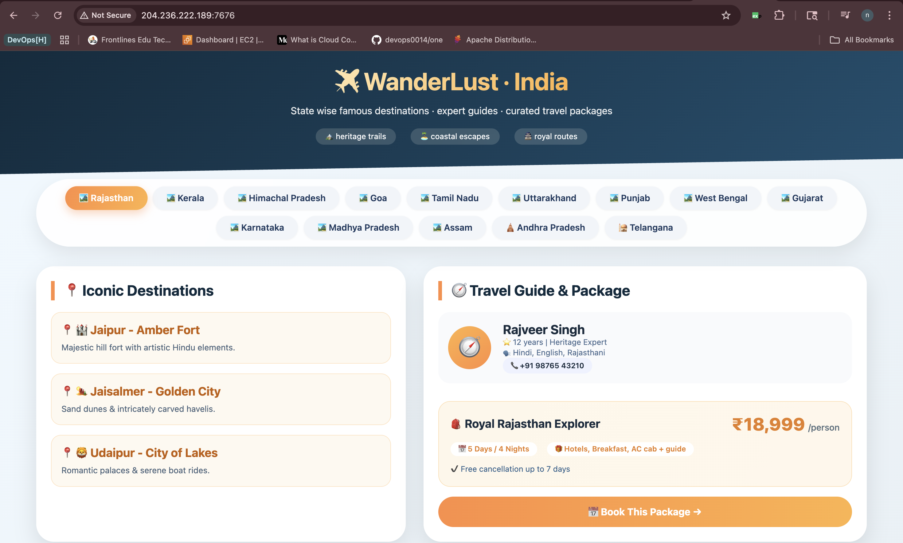
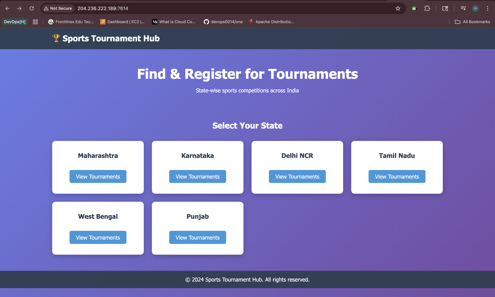
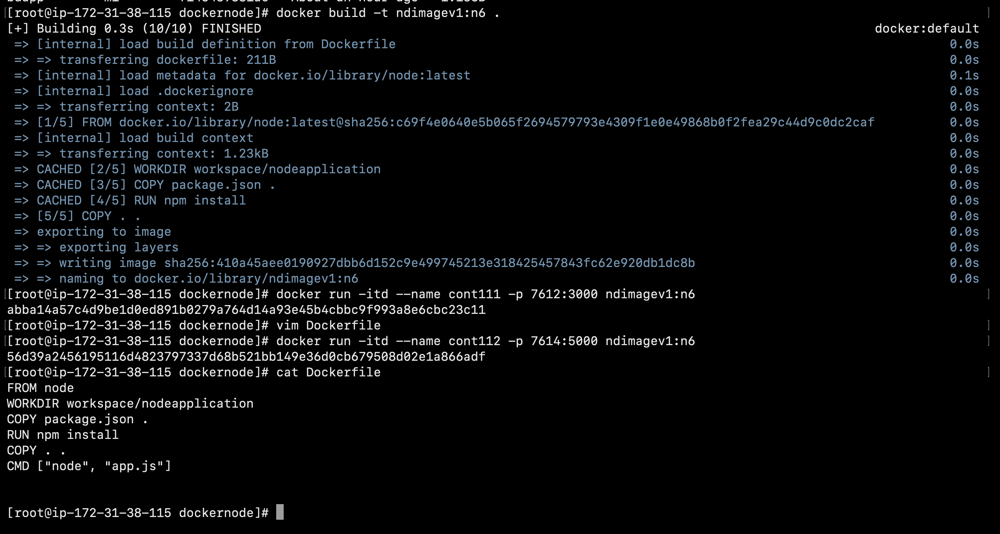
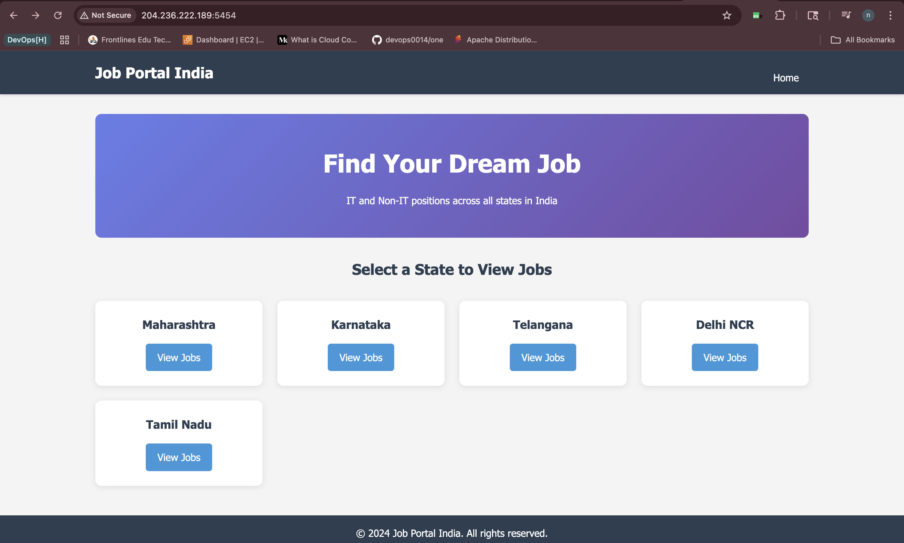

# Containerized-web-apps

> A hands-on collection of containerized **frontend** and **backend** applications demonstrating how to package, build, and run real web apps using Docker.

[](https://www.docker.com)
[](https://httpd.apache.org)
[](https://nginx.org)
[](https://nodejs.org)
[](https://www.python.org)

---

## Table of Contents

- [Overview](#overview)
- [Repository Structure](#repository-structure)
- [Prerequisites](#prerequisites)
- [Frontend Applications](#frontend-applications)
  - [Apache HTTPD Deployment](#apache-httpd-deployment)
  - [Nginx Deployment](#nginx-deployment)
- [Backend Applications](#backend-applications)
  - [Node.js Application](#nodejs-application)
  - [Python Flask Application](#python-flask-application)
- [Docker Command Reference](#docker-command-reference)
- [Common Workflow](#common-workflow)

---

## Overview

This repository contains four sample projects that show how to **deploy web applications inside Docker containers**. The goal is simple — take an existing application (frontend or backend), write a `Dockerfile` for it, build the image, and run it as a container so the application can be accessed over a browser or API client.

The projects are split into two categories:

| Category | Projects | Purpose |
|----------|----------|---------|
| **Frontend** | `metalmatrix-webapp` (HTTPD), `tourism-webapp-nginx` (Nginx) | Static web pages served by a web server |
| **Backend** | `sportstournament-node` (Node.js + Express), `careersportal-python` (Python + Flask) | Dynamic applications with routes, views, and dependencies |

---

## Repository Structure

```
Docker_Deployment/
├── metalmatrix-webapp/              # Frontend — served via Apache HTTPD
│   ├── Dockerfile
│   └── index.html
│
├── tourism-webapp-nginx/            # Frontend — served via Nginx
│   ├── Dockerfile
│   └── index.html
│
├── sportstournament-node/           # Backend — Node.js + Express
│   ├── Dockerfile
│   ├── app.js                       # Main application entry point
│   ├── package.json                 # Project dependencies
│   ├── views/                       # EJS templates
│   │   ├── index.ejs
│   │   ├── tournaments.ejs
│   │   └── register.ejs
│   ├── public/                      # Static assets
│   │   ├── style.css
│   │   └── script.js
│   └── data/
│       └── tournaments.js
│
└── careersportal-python/            # Backend — Python + Flask
    ├── Dockerfile
    ├── app.py                       # Main application entry point
    ├── requirements.txt             # Python dependencies
    ├── templates/                   # Jinja2 templates
    ├── static/                      # Static assets
    └── data/
```

---

## Prerequisites

Before building or running any of these images, make sure the following are available on your system:

| Requirement | Notes |
|-------------|-------|
| **Docker Engine** | Installed and running |
| **Terminal / Shell** | Bash, Zsh, or PowerShell |
| **Free host ports** | Used for mapping container ports (e.g. `6000`, `8080`) |

Verify Docker is working:

```bash
docker --version
docker info
```

---

## Frontend Applications

A frontend application here is a basic web app — for example a single `index.html` file we have already built on our system. To deploy it through Docker, we simply place the file inside the **default content directory of the web server** that lives in the base image. Once placed there, the web server serves it automatically when the container starts.

### Apache HTTPD Deployment

**Project:** `metalmatrix-webapp/`

The default document root for Apache HTTPD is `/usr/local/apache2/htdocs`, so the `index.html` is copied to that path inside the image.

**Dockerfile:**

```dockerfile
FROM httpd
COPY index.html /usr/local/apache2/htdocs/
```

| Instruction | Purpose |
|-------------|---------|
| `FROM httpd` | Pulls the official Apache HTTPD image as the base layer |
| `COPY index.html /usr/local/apache2/htdocs/` | Places our web page in the default path that HTTPD serves |

**Build the image:**

```bash
cd metalmatrix-webapp
docker build -t metalmatrix-img .
```

> The `.` at the end tells Docker to use the **current directory** as the build context.

**Run the container:**

```bash
docker run -itd --name metalmatrix-cont -p 6000:80 metalmatrix-img
```

**Access the app:** open `http://localhost:6000` in a browser.

**Preview:**


### Nginx Deployment

**Project:** `tourism-webapp-nginx/`

A state-wise travel guide and tourism packages page. Nginx serves static files from `/usr/share/nginx/html` by default, so our `index.html` is placed there.

**Dockerfile:**

```dockerfile
FROM nginx
COPY index.html /usr/share/nginx/html
```

| Instruction | Purpose |
|-------------|---------|
| `FROM nginx` | Pulls the official Nginx image as the base layer |
| `COPY index.html /usr/share/nginx/html` | Places our web page in Nginx's default serving path |

**Build the image:**

```bash
cd tourism-webapp-nginx
docker build -t tourism-nginx-img .
```

**Run the container:**

```bash
docker run -itd --name tourism-nginx-cont -p 7000:80 tourism-nginx-img
```

**Access the app:** open `http://localhost:7000` in a browser.

**Preview:**



---

## Backend Applications

A backend application is more than just static files — the developer hands over a **project structure** containing source code, dependencies, templates, and configuration. The job of the Dockerfile here is to:

1. Pick a base image with the required runtime (Node.js or Python).
2. Set a working directory inside the container.
3. Copy the dependency manifest first and install dependencies.
4. Copy the rest of the source code.
5. Define the command that starts the application.

Copying the dependency file **before** the rest of the code lets Docker cache the install layer — re-builds become much faster when only application code changes.

### Node.js Application

**Project:** `sportstournament-node/`

A state-wise sports tournament registration system built with Express and EJS.

**Project layout:**

```
sportstournament-node/
├── app.js               # Main file
├── package.json         # Dependencies
├── views/               # EJS templates
│   ├── index.ejs
│   ├── tournaments.ejs
│   └── register.ejs
├── public/              # Static assets
│   ├── style.css
│   └── script.js
└── data/
    └── tournaments.js
```

**Dockerfile:**

```dockerfile
FROM node
WORKDIR workspace/nodeapplication
COPY package.json .
RUN npm install
COPY . .
CMD ["node", "app.js"]
```

| Instruction | Purpose |
|-------------|---------|
| `FROM node` | Uses the official Node.js base image |
| `WORKDIR workspace/nodeapplication` | Creates and switches to the working directory inside the container |
| `COPY package.json .` | Copies only the dependency manifest first |
| `RUN npm install` | Installs the Node.js dependencies |
| `COPY . .` | Copies the rest of the project source |
| `CMD ["node", "app.js"]` | Starts the application when the container runs |

**Build and run:**

```bash
cd sportstournament-node
docker build -t sportstournament-img .
docker run -itd --name sportstournament-cont -p 8080:3000 sportstournament-img
```

> Replace `3000` with the actual port your `app.js` listens on if it differs.

**Preview:**





### Python Flask Application

**Project:** `careersportal-python/`

A Flask-based career portal backend.

**Dockerfile:**

```dockerfile
FROM python
WORKDIR /project/workspace
COPY requirements.txt .
RUN pip install -r requirements.txt
COPY . .
CMD ["python", "app.py"]
```

| Instruction | Purpose |
|-------------|---------|
| `FROM python` | Uses the official Python base image |
| `WORKDIR /project/workspace` | Creates and switches to the working directory inside the container |
| `COPY requirements.txt .` | Copies the dependency file first |
| `RUN pip install -r requirements.txt` | Installs the Python dependencies (Flask, Flask-Mail) |
| `COPY . .` | Copies the rest of the source code |
| `CMD ["python", "app.py"]` | Starts the Flask application |

**Build and run:**

```bash
cd careersportal-python
docker build -t careersportal-python-img .
docker run -itd --name careersportal-python-cont -p 5000:5000 careersportal-python-img
```

**Preview:**



---

## Docker Command Reference

A quick reference to the commands used across this repository.

### Build an image

```bash
docker build -t <image-name> .
```

| Argument | Meaning |
|----------|---------|
| `-t <image-name>` | Tags (names) the resulting image |
| `.` | Build context — the current directory |

### Run a container

```bash
docker run -itd --name <container-name> -p <host-port>:<container-port> <image-name>
```

| Flag | Meaning |
|------|---------|
| `-i` | Interactive mode (keep STDIN open) |
| `-t` | Allocates a pseudo-terminal |
| `-d` | Runs the container in detached (background) mode |
| `--name <container-name>` | Assigns a friendly name to the container |
| `-p <host-port>:<container-port>` | Maps a host port to the port the application listens on inside the container |
| `<image-name>` | The image to run |

**Example:**

```bash
docker run -itd --name cont -p 6000:80 myimage
```

This means: run `myimage` in the background as `cont`, and forward host port **6000** to container port **80**, so visiting `http://localhost:6000` reaches the application.

### Useful inspection commands

| Command | Purpose |
|---------|---------|
| `docker images` | List all built images |
| `docker ps` | List running containers |
| `docker ps -a` | List all containers (including stopped) |
| `docker logs <container-name>` | View container logs |
| `docker exec -it <container-name> bash` | Open a shell inside a running container |
| `docker stop <container-name>` | Stop a running container |
| `docker rm <container-name>` | Remove a stopped container |
| `docker rmi <image-name>` | Remove an image |

---

## Common Workflow

The end-to-end flow for any application in this repository is:

```
1. Move into the application directory
        │
        ▼
2. Review the Dockerfile (base image, paths, commands)
        │
        ▼
3. Build the image  →  docker build -t <name> .
        │
        ▼
4. Run the container with port mapping  →  docker run -itd --name <c> -p <host>:<container> <name>
        │
        ▼
5. Open the application in a browser or test the API
        │
        ▼
6. Stop / remove the container when done
```

Once these steps are complete, the web application is **deployed via Docker** — without manually installing the web server, runtime, or dependencies on the host machine.

---

<div align="center">
  <sub>Sample projects for learning <strong>Docker-based application deployment</strong>.</sub>
</div>
